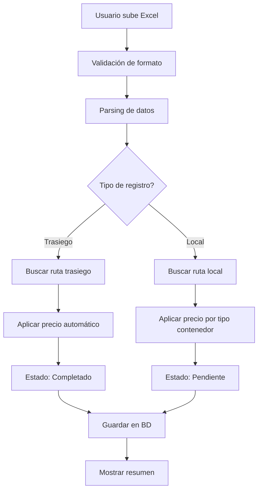
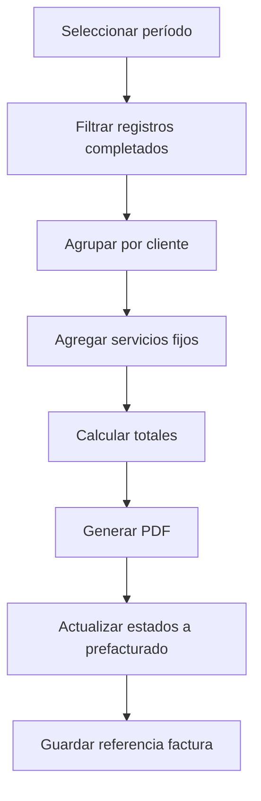
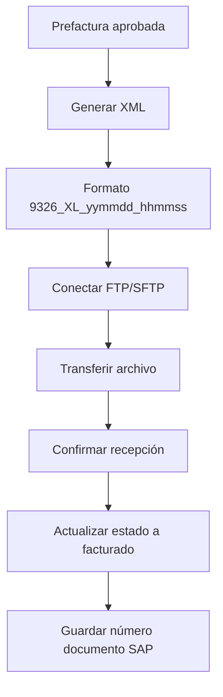
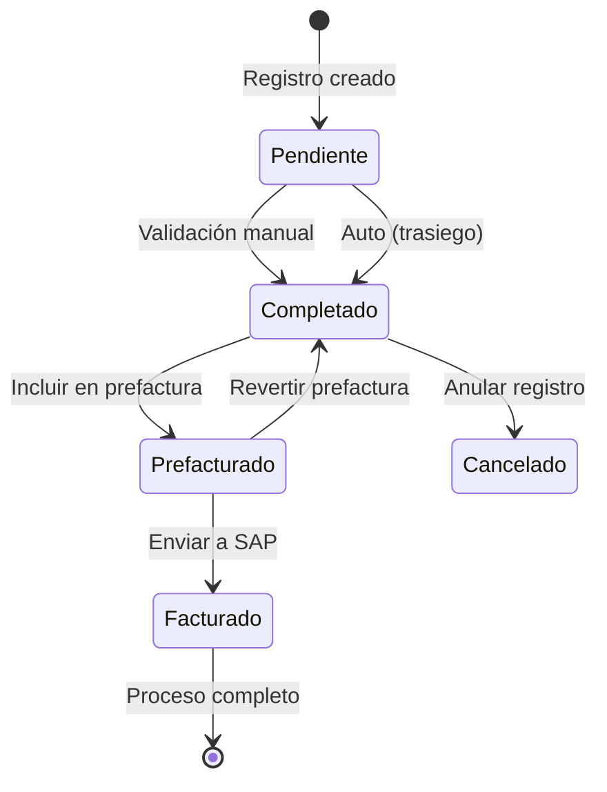

# Documentación Completa del Módulo PTYSS Dashboard

## Índice
1. [Introducción](#introducción)
2. [Arquitectura del Sistema](#arquitectura-del-sistema)
3. [Frontend - Componentes y Funcionalidades](#frontend---componentes-y-funcionalidades)
4. [Backend - APIs y Servicios](#backend---apis-y-servicios)
5. [Base de Datos - Esquemas y Modelos](#base-de-datos---esquemas-y-modelos)
6. [Flujo de Datos Completo](#flujo-de-datos-completo)
7. [Sistema de Configuración y Pricing](#sistema-de-configuración-y-pricing)
8. [Integración con SAP](#integración-con-sap)
9. [Estados y Workflow](#estados-y-workflow)
10. [Guía de Implementación](#guía-de-implementación)

---A

## 1. Introducción

El módulo **PTYSS Dashboard** es un sistema integral para la gestión de servicios marítimos de transporte de contenedores. Maneja dos tipos principales de operaciones:

- **Trasiego**: Operaciones entre terminales marítimos (procesamiento automático)
- **Local**: Operaciones terrestres con rutas personalizables

### Características Principales:
- Procesamiento automático de archivos Excel
- Matching inteligente de rutas y precios
- Sistema de prefacturación y facturación
- Integración completa con SAP
- Gestión de esquemas de rutas personalizables
- Reportes y analytics en tiempo real

---

## 2. Arquitectura del Sistema

### Stack Tecnológico

#### Frontend
- **Framework**: Next.js 14 con App Router
- **UI Components**: shadcn/ui + Tailwind CSS
- **Estado**: Redux Toolkit
- **Validaciones**: Zod
- **PDF Generation**: jsPDF + autoTable
- **Charts**: Recharts

#### Backend
- **Runtime**: Node.js + Express
- **Base de Datos**: MongoDB con Mongoose
- **Autenticación**: JWT
- **File Transfer**: FTP/SFTP para SAP
- **Validación**: Joi

### Estructura de Carpetas

```
barcos/
├── front/
│   ├── app/ptyss/              # Páginas del módulo PTYSS
│   ├── components/ptyss/       # Componentes React
│   └── lib/features/           # Redux slices
│
└── api/
    ├── src/controllers/         # Lógica de negocio
    │   ├── ptyssRoutesControllers/
    │   └── ptyssLocalRoutesControllers/
    ├── src/database/schemas/   # Modelos MongoDB
    └── src/routes/              # Endpoints API
```

---

## 3. Frontend - Componentes y Funcionalidades

### 3.1 Dashboard Principal
**Archivo**: `front/components/ptyss/ptyss-dashboard.tsx`

#### Funcionalidades:
- Vista general con estadísticas clave
- Navegación rápida a todas las secciones
- Servicios recientes con estados
- Acciones rápidas

#### Métricas Mostradas:
- Servicios Activos
- Archivos Procesados
- Ingresos del Mes
- Tiempo Promedio de Procesamiento

```typescript
// Estructura de datos del dashboard
const stats = {
  serviciosActivos: number,
  archivosProcesados: number,
  ingresosDelMes: string,
  tiempoPromedio: string
}
```

### 3.2 Sistema de Upload de Excel
**Archivo**: `front/components/ptyss/ptyss-upload.tsx`

#### Proceso de Carga:
1. **Validación de Formato**: Verificación de estructura Excel
2. **Parsing**: Extracción de datos usando excel-parser
3. **Clasificación**: Detección automática trasiego vs local
4. **Matching de Rutas**:
   - Trasiego: Por leg + moveType + containerType
   - Local: Por origen/destino + tipo contenedor + cliente

#### Campos Excel Requeridos:
```typescript
interface PTYSSExcelRow {
  date: Date
  leg: string           // Ruta (ej: "BALBOA/CRISTOBAL")
  moveType: string      // "S" o "RT"
  containerType: string // "DV", "HC", "RE", "HR"
  origin: string        // Para rutas locales
  destination: string   // Para rutas locales
  vessel: string
  voyage: string
  containerNumber: string
  quantity: number
}
```

### 3.3 Gestión de Registros
**Archivo**: `front/components/ptyss/ptyss-records.tsx`

#### Características:
- **Tabla Paginada**: Vista de todos los registros
- **Filtros Avanzados**:
  - Por estado (pendiente, completado, prefacturado)
  - Por tipo (trasiego, local)
  - Por rango de fechas
  - Por cliente/naviera
- **Acciones por Registro**:
  - Ver detalles completos
  - Editar información
  - Eliminar (con confirmación)
  - Cambiar estado

#### Estados del Registro:
```typescript
type RecordStatus = 
  | "pendiente"     // Inicial para locales
  | "completado"    // Listo para prefactura
  | "prefacturado"  // Incluido en prefactura
  | "facturado"     // Factura enviada a SAP
```

### 3.4 Sistema de Prefacturación
**Archivo**: `front/components/ptyss/ptyss-prefactura.tsx`

#### Flujo de Prefacturación:
1. **Selección de Período**: Fecha inicio y fin
2. **Filtrado de Registros**: Solo completados no facturados
3. **Adición de Servicios**:
   - Servicios fijos automáticos
   - Servicios adicionales opcionales
4. **Generación de PDF**: Con detalles y totales
5. **Actualización de Estados**: Marca como prefacturados

#### Servicios Fijos:
```typescript
const serviciosFijos = [
  { code: "CLG097", description: "Cleaning/Gate", price: 150 },
  { code: "TRK163", description: "Truck Services", price: 200 },
  { code: "TRK179", description: "Additional Trucking", price: 250 },
  { code: "SLR168", description: "Sealing/Repair", price: 100 }
]
```

### 3.5 Configuración de Rutas
**Archivo**: `front/components/ptyss/ptyss-config.tsx`

#### Rutas de Trasiego:
- Gestión CRUD completa
- Precios diferenciados por:
  - Tipo de contenedor (normal/refrigerado)
  - Tipo de ruta (single/round trip)
- Validación de duplicados

#### Estructura de Ruta:
```typescript
interface PTYSSRoute {
  name: string         // "BALBOA/CRISTOBAL"
  from: string         // "BALBOA"
  to: string          // "CRISTOBAL"
  containerType: "normal" | "refrigerated"
  routeType: "single" | "RT"
  price: number
}
```

### 3.6 Sistema de Rutas Locales
**Archivo**: `front/components/ptyss/ptyss-local-routes.tsx`

#### Concepto de Esquemas:
- **Esquema**: Agrupación de rutas para un cliente
- **Rutas**: Pares origen-destino con precios
- **Asociación**: Vinculación con clientes reales

#### Gestión de Esquemas:
```typescript
interface RouteSchema {
  name: string              // Nombre del esquema
  routes: LocalRoute[]      // Array de rutas
  associatedClients: string[] // IDs de clientes reales
}

interface LocalRoute {
  from: string
  to: string
  priceRegular: number  // Contenedores DV/HC
  priceReefer: number   // Contenedores RE
}
```

### 3.7 Historial
**Archivo**: `front/components/ptyss/ptyss-history.tsx`

#### Funcionalidades:
- Vista histórica completa de registros
- Exportación a Excel
- Filtros por período
- Detalles expandibles por registro

### 3.8 Reportes y Analytics
**Archivo**: `front/components/ptyss/ptyss-reports.tsx`

#### KPIs Principales:
- Total de servicios por período
- Ingresos acumulados
- Top 10 clientes por facturación
- Rendimiento por ruta
- Tendencias mensuales

#### Visualizaciones:
- Gráficos de barras para comparaciones
- Líneas de tendencia temporal
- Tablas de ranking
- Métricas de crecimiento

---

## 4. Backend - APIs y Servicios

### 4.1 Controladores de Rutas de Trasiego

#### Endpoints Principales:

```typescript
// GET /api/ptyss-routes
getAllPTYSSRoutes() // Obtiene todas las rutas activas

// POST /api/ptyss-routes
createPTYSSRoute({
  from: string,
  to: string,
  containerType: string,
  routeType: string,
  price: number
})

// PUT /api/ptyss-routes/:id
updatePTYSSRoute(id, updatedData)

// DELETE /api/ptyss-routes/:id
deletePTYSSRoute(id)
```

### 4.2 Controladores de Rutas Locales

#### Gestión de Esquemas:

```typescript
// GET /api/ptyss-local-routes/schemas
getSchemaSummary() // Resumen de todos los esquemas

// POST /api/ptyss-local-routes/schema
createRouteSchema({
  name: string,
  routes: LocalRoute[]
})

// DELETE /api/ptyss-local-routes/schema/:name
deleteRouteSchema(schemaName)
```

#### Asociación de Clientes:

```typescript
// POST /api/ptyss-local-routes/associate
associateClientToRouteSet({
  schemaName: string,
  clientId: string
})

// POST /api/ptyss-local-routes/disassociate
disassociateClientFromRouteSet({
  schemaName: string,
  clientId: string
})
```

### 4.3 Procesamiento de Records

**Archivo**: `api/src/controllers/recordsControllers/createPTYSSRecords.ts`

#### Lógica de Procesamiento:

```typescript
async function createPTYSSRecords(records: PTYSSRecord[]) {
  for (const record of records) {
    // 1. Detectar tipo (trasiego vs local)
    const isTrasiego = record.leg && record.moveType
    
    // 2. Buscar ruta correspondiente
    let route, price
    if (isTrasiego) {
      route = await findTrasieguRoute(record)
      record.status = "completado" // Automático
    } else {
      route = await findLocalRoute(record)
      record.status = "pendiente" // Requiere validación
    }
    
    // 3. Aplicar pricing
    record.price = calculatePrice(route, record.containerType)
    
    // 4. Guardar en base de datos
    await Record.create(record)
  }
}
```

---

## 5. Base de Datos - Esquemas y Modelos

### 5.1 Esquema de Rutas de Trasiego

**Archivo**: `api/src/database/schemas/ptyssRouteSchema.ts`

```typescript
const ptyssRouteSchema = new Schema({
  name: {
    type: String,
    required: true,
    // Auto-generado: "FROM/TO"
  },
  from: {
    type: String,
    required: true,
    uppercase: true
  },
  to: {
    type: String,
    required: true,
    uppercase: true
  },
  containerType: {
    type: String,
    enum: ['normal', 'refrigerated'],
    required: true
  },
  routeType: {
    type: String,
    enum: ['single', 'RT'],
    required: true
  },
  price: {
    type: Number,
    required: true,
    min: 0
  }
})

// Índice único compuesto
ptyssRouteSchema.index({ 
  name: 1, 
  containerType: 1, 
  routeType: 1 
}, { unique: true })
```

### 5.2 Esquema de Rutas Locales

**Archivo**: `api/src/database/schemas/ptyssLocalRouteSchema.ts`

```typescript
const ptyssLocalRouteSchema = new Schema({
  clientName: {
    type: String,
    required: true,
    // Nombre del esquema
  },
  realClientId: {
    type: Schema.Types.ObjectId,
    ref: 'Client',
    // Cliente real asociado (opcional)
  },
  from: {
    type: String,
    required: true,
    uppercase: true
  },
  to: {
    type: String,
    required: true,
    uppercase: true
  },
  priceRegular: {
    type: Number,
    required: true,
    min: 0
    // Para contenedores DV/HC
  },
  priceReefer: {
    type: Number,
    required: true,
    min: 0
    // Para contenedores RE
  },
  price: {
    type: Number,
    // Legacy field para compatibilidad
  }
})

// Índices
ptyssLocalRouteSchema.index({ 
  clientName: 1, 
  from: 1, 
  to: 1 
}, { unique: true })

ptyssLocalRouteSchema.index({ realClientId: 1 })
ptyssLocalRouteSchema.index({ clientName: 1 })
```

### 5.3 Esquema de Records

```typescript
const recordSchema = new Schema({
  module: {
    type: String,
    enum: ['PTYSS', 'TRUCKING'],
    required: true
  },
  excelFileId: {
    type: Schema.Types.ObjectId,
    ref: 'ExcelFile',
    required: true
  },
  status: {
    type: String,
    enum: ['pendiente', 'completado', 'prefacturado', 'facturado'],
    default: 'pendiente'
  },
  // Campos específicos PTYSS
  leg: String,           // Ruta trasiego
  moveType: String,      // S o RT
  containerType: String, // DV, HC, RE, HR
  origin: String,        // Para rutas locales
  destination: String,   // Para rutas locales
  vessel: String,
  voyage: String,
  containerNumber: String,
  quantity: Number,
  price: Number,
  serviceDate: Date,
  // Tracking
  createdBy: {
    type: Schema.Types.ObjectId,
    ref: 'User'
  },
  prefacturaId: {
    type: Schema.Types.ObjectId,
    ref: 'Invoice'
  },
  sapDocumentNumber: String
}, {
  timestamps: true
})
```

---

## 6. Flujo de Datos Completo

### 6.1 Flujo de Carga de Excel



### 6.2 Flujo de Prefacturación



### 6.3 Flujo de Integración SAP



---

## 7. Sistema de Configuración y Pricing

### 7.1 Pricing de Trasiego

#### Matriz de Precios:
| Ruta | Tipo Contenedor | Tipo Movimiento | Precio |
|------|----------------|-----------------|--------|
| BALBOA/CRISTOBAL | Normal (HC) | Single | $450 |
| BALBOA/CRISTOBAL | Normal (HC) | RT | $850 |
| BALBOA/CRISTOBAL | Refrigerado (HR) | Single | $550 |
| BALBOA/CRISTOBAL | Refrigerado (HR) | RT | $1050 |

### 7.2 Pricing de Rutas Locales

#### Estructura de Precios:
- **Regular (DV/HC)**: Precio base para contenedores secos
- **Reefer (RE)**: Típicamente +20-30% sobre regular

#### Ejemplo de Esquema:
```typescript
const esquemaEjemplo = {
  name: "MSC_LOCAL_ROUTES",
  routes: [
    {
      from: "PANAMA CITY",
      to: "COLON",
      priceRegular: 250,
      priceReefer: 325
    },
    {
      from: "BALBOA",
      to: "TOCUMEN",
      priceRegular: 300,
      priceReefer: 390
    }
  ],
  associatedClients: ["client_id_1", "client_id_2"]
}
```

### 7.3 Servicios Adicionales

#### Configuración de Servicios:
```typescript
const serviciosConfigurables = {
  fijos: [
    { code: "CLG097", mandatorio: true },
    { code: "TRK163", mandatorio: false },
    { code: "TRK179", mandatorio: false },
    { code: "SLR168", mandatorio: true }
  ],
  dinamicos: [
    // Configurables por usuario
  ]
}
```

---

## 8. Integración con SAP

### 8.1 Generación de XML

#### Estructura del XML:
```xml
<?xml version="1.0" encoding="UTF-8"?>
<Invoice>
  <Header>
    <DocumentType>9326</DocumentType>
    <DocumentNumber>XL_241115_143022</DocumentNumber>
    <Date>2024-11-15</Date>
    <ClientCode>C001234</ClientCode>
  </Header>
  <Lines>
    <Line>
      <ServiceCode>PTY001</ServiceCode>
      <Description>TRASIEGO BALBOA/CRISTOBAL</Description>
      <Quantity>1</Quantity>
      <UnitPrice>450.00</UnitPrice>
      <Total>450.00</Total>
    </Line>
    <Line>
      <ServiceCode>CLG097</ServiceCode>
      <Description>CLEANING/GATE</Description>
      <Quantity>1</Quantity>
      <UnitPrice>150.00</UnitPrice>
      <Total>150.00</Total>
    </Line>
  </Lines>
  <Summary>
    <Subtotal>600.00</Subtotal>
    <Tax>0.00</Tax>
    <Total>600.00</Total>
  </Summary>
</Invoice>
```

### 8.2 Configuración FTP/SFTP

```typescript
const ftpConfig = {
  host: process.env.SAP_FTP_HOST,
  port: 21,
  user: process.env.SAP_FTP_USER,
  password: process.env.SAP_FTP_PASSWORD,
  secure: true,
  secureOptions: {
    rejectUnauthorized: false
  }
}

const sftpConfig = {
  host: process.env.SAP_SFTP_HOST,
  port: 22,
  username: process.env.SAP_SFTP_USER,
  password: process.env.SAP_SFTP_PASSWORD,
  privateKey: fs.readFileSync('/path/to/key')
}
```

### 8.3 Proceso de Transferencia

```typescript
async function sendToSAP(xmlContent: string) {
  // 1. Generar nombre de archivo
  const fileName = `9326_XL_${format(new Date(), 'yyMMdd_HHmmss')}.XML`
  
  // 2. Conectar al servidor
  const client = new FTPClient()
  await client.connect(ftpConfig)
  
  // 3. Subir archivo
  await client.put(xmlContent, `/sap/incoming/${fileName}`)
  
  // 4. Verificar transferencia
  const exists = await client.exists(`/sap/incoming/${fileName}`)
  
  // 5. Cerrar conexión
  await client.end()
  
  return { success: exists, fileName }
}
```

---

## 9. Estados y Workflow

### 9.1 Diagrama de Estados



### 9.2 Reglas de Negocio

#### Transiciones Permitidas:
- **Pendiente → Completado**: Solo para rutas locales validadas
- **Completado → Prefacturado**: Solo registros con precio asignado
- **Prefacturado → Facturado**: Solo con documento SAP generado
- **Cualquier estado → Cancelado**: Con permisos de admin

#### Validaciones:
```typescript
const validaciones = {
  paraCompletar: {
    precioAsignado: true,
    rutaValidada: true,
    datosCompletos: true
  },
  paraPrefacturar: {
    estadoCompletado: true,
    clienteActivo: true,
    periodoAbierto: true
  },
  paraFacturar: {
    prefacturaAprobada: true,
    xmlGenerado: true,
    sapConectado: true
  }
}
```

---

## 10. Guía de Implementación

### 10.1 Instalación y Configuración

#### Requisitos Previos:
- Node.js 18+
- MongoDB 6+
- Acceso FTP/SFTP para SAP

#### Variables de Entorno:

```env
# Backend
MONGODB_URI=mongodb://localhost:27017/barcos
JWT_SECRET=your_jwt_secret
PORT=5000

# SAP Integration
SAP_FTP_HOST=sap.company.com
SAP_FTP_USER=ptyss_user
SAP_FTP_PASSWORD=secure_password
SAP_FTP_PATH=/incoming/invoices

# Frontend
NEXT_PUBLIC_API_URL=http://localhost:5000/api
```

### 10.2 Comandos de Desarrollo

```bash
# Backend
cd api
npm install
npm run dev

# Frontend
cd front
npm install
npm run dev

# Seed inicial de datos
cd api
npm run seed:ptyss-routes
npm run seed:local-routes
npm run seed:clients
```

### 10.3 Deployment

#### Build de Producción:
```bash
# Backend
cd api
npm run build
npm start

# Frontend
cd front
npm run build
npm start
```

#### Docker Compose:
```yaml
version: '3.8'
services:
  mongodb:
    image: mongo:6
    volumes:
      - mongo_data:/data/db
    ports:
      - "27017:27017"
  
  api:
    build: ./api
    environment:
      - MONGODB_URI=mongodb://mongodb:27017/barcos
    depends_on:
      - mongodb
    ports:
      - "5000:5000"
  
  frontend:
    build: ./front
    environment:
      - NEXT_PUBLIC_API_URL=http://api:5000/api
    depends_on:
      - api
    ports:
      - "3000:3000"

volumes:
  mongo_data:
```

### 10.4 Monitoreo y Mantenimiento

#### Logs Importantes:
```typescript
// Tracking de procesamiento
logger.info('PTYSS_UPLOAD', {
  userId,
  fileName,
  recordsCount,
  processTime
})

// Errores de matching
logger.error('ROUTE_NOT_FOUND', {
  record,
  searchCriteria,
  availableRoutes
})

// Transferencias SAP
logger.info('SAP_TRANSFER', {
  fileName,
  status,
  documentNumber,
  transferTime
})
```

#### Métricas Clave:
- Tiempo promedio de procesamiento de Excel
- Tasa de éxito en matching de rutas
- Porcentaje de registros facturados
- Tiempo de respuesta de APIs
- Éxito en transferencias SAP

### 10.5 Troubleshooting Común

#### Problema: Rutas no se encuentran
**Solución**: Verificar que las rutas estén configuradas con el formato exacto esperado (mayúsculas, espacios)

#### Problema: FTP/SFTP falla
**Solución**: Verificar credenciales, firewall, y formato de archivo XML

#### Problema: Estados inconsistentes
**Solución**: Ejecutar script de validación de integridad de datos

```typescript
// Script de validación
async function validateDataIntegrity() {
  // Verificar registros huérfanos
  const orphanRecords = await Record.find({
    excelFileId: { $exists: false }
  })
  
  // Verificar estados inválidos
  const invalidStates = await Record.find({
    status: { $nin: ['pendiente', 'completado', 'prefacturado', 'facturado'] }
  })
  
  // Verificar precios faltantes
  const noPriceRecords = await Record.find({
    status: 'completado',
    price: { $exists: false }
  })
  
  return {
    orphanRecords,
    invalidStates,
    noPriceRecords
  }
}
```

---

## Conclusión

El módulo PTYSS Dashboard es un sistema robusto y completo para la gestión de servicios marítimos. Su arquitectura modular permite escalabilidad y mantenimiento eficiente, mientras que su integración con SAP asegura la continuidad del flujo de facturación empresarial.

### Puntos Clave:
- **Automatización**: Procesamiento automático de trasiego
- **Flexibilidad**: Esquemas personalizables para clientes
- **Trazabilidad**: Estados y workflow bien definidos
- **Integración**: Conexión directa con sistemas SAP
- **Escalabilidad**: Arquitectura preparada para crecimiento

Para soporte adicional o consultas específicas, contactar al equipo de desarrollo.

---

*Documento generado el 15 de Noviembre de 2024*
*Versión: 1.0.0*